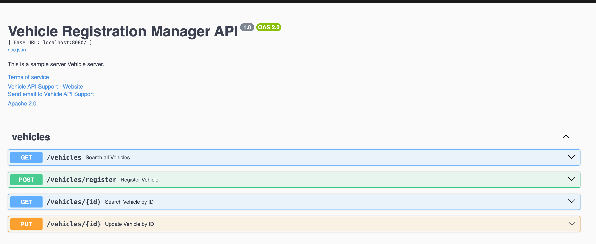

[](https://sonarcloud.io/summary/overall?id=ArianeASA_vehicle-registration-manager)
[](https://sonarcloud.io/summary/overall?id=ArianeASA_vehicle-registration-manager)
[](https://github.com/ArianeASA/vehicle-registration-manager/actions/workflows/sonar.yml)
[](https://github.com/ArianeASA/vehicle-registration-manager/actions/workflows/build.yml)
[](https://github.com/ArianeASA/vehicle-registration-manager/actions/workflows/migration-apply.yml)
# Vehicle Registration Manager

This project is a sample server for managing vehicles, built with Go.

## Description

The Vehicle Registration Manager is a sample server application built with Go for managing vehicle data. It provides RESTful API endpoints for listing, searching, registering, and updating vehicles. The project includes database migration support using goose, and API documentation generated with Swagger. The application can be run locally or with Docker Compose for easy setup and deployment.

## Getting Started

### Prerequisites

- Go 1.23 or higher
- Make sure to have `go.mod` and `go.sum` files in your project directory
- [goose](https://github.com/pressly/goose) CLI tool for database migrations 

### Installing

1. Clone the repository:
    ```sh
    git clone https://github.com/ArianeASA/vehicle-registration-manager.git
    cd vehicle-registration-manager
    ```

2. Install dependencies:
    ```sh
    go mod tidy
    ```

### Running the Application with Makefile

1. **Start the database with Docker Compose**:
    ```sh
    make docker-up-database
    ```
   The database is started in a Docker container using the `docker-compose.yml` file.
   Use database type postgres to run the database in a Docker container.
   
   Configurations:
      - POSTGRES_USER=yourusername
     - POSTGRES_PASSWORD=yourpassword
     - POSTGRES_DB=dealership
     - Schema: prod
   
   The database will start on http://localhost:5432.


2. **Check database migrations status**:
    ```sh
    make goose-status
    ```

3. **Run database migrations**:
    ```sh
    make goose-up
    ```
   All database migrations are stored in the `migrations` directory.


4. **Generate API documentation**:
    ```sh
    make doc
    ```
   The API documentation is available in the docs/swagger.json file. You can use Swagger UI to visualize and interact with the API.  
   The Swagger UI is available at http://localhost:8080/swagger/index.html.

   

5. **Run the application**:
    ```sh
    make run
    ```
   The server will start on http://localhost:8080.


6. **Rollback database migrations**:
    ```sh
    make goose-down
    ```
    
7. **Stop the application with Docker Compose**:
    ```sh
    make docker-down-all
    ```
   

8. **Clean up generated files**:
    ```sh
    make clean
    ```
   

9. **Show help message**:
    ```sh
    make help
    ```
   
### License
This project is licensed under the Apache 2.0 License - see the LICENSE file for details.